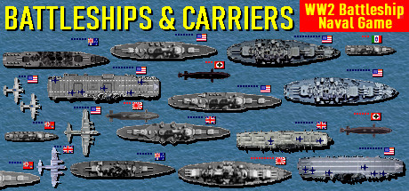

<!-- ABOUT THE PROJECT -->
# 🛳 Battleships

## Introduction
This application implements a backend to be able to play the famous naval battle game

### Built With

* [Node Js](https://nodejs.org/es/)
* [Socket.io](https://socket.io/)

### Installation

-Clone the repository

-To install and run this proyect just type and execute

`npm install`

-Start the proyect with

`npm start`

(<a href="#top">back to top</a>)
